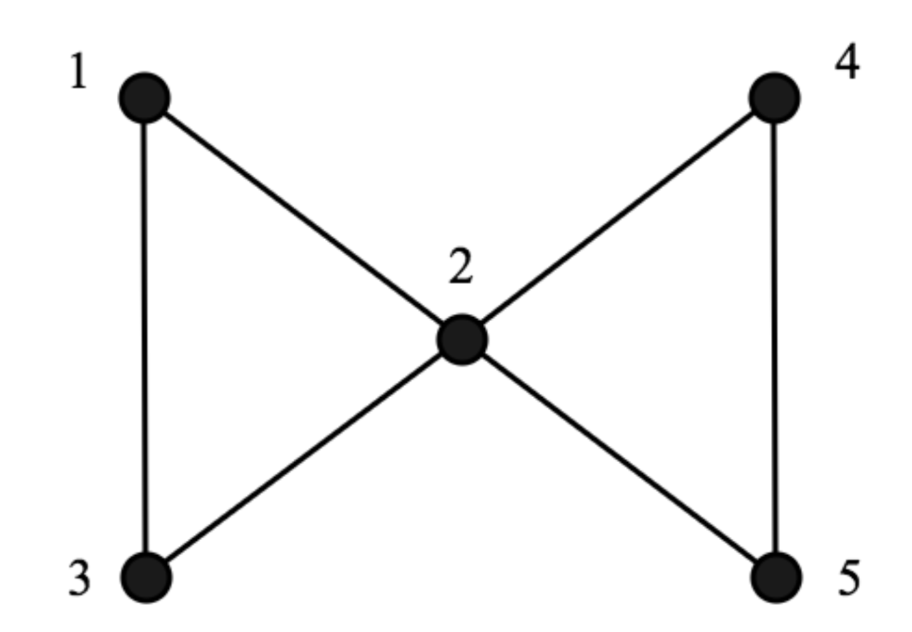
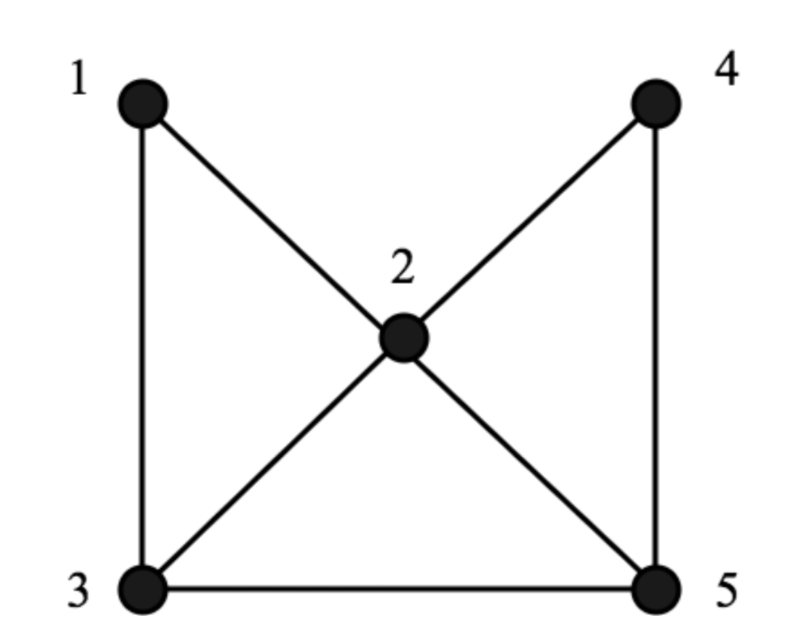
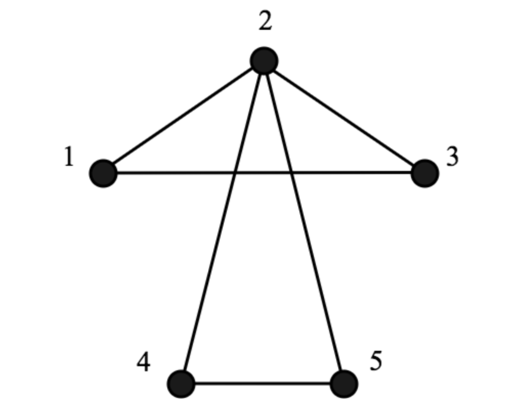
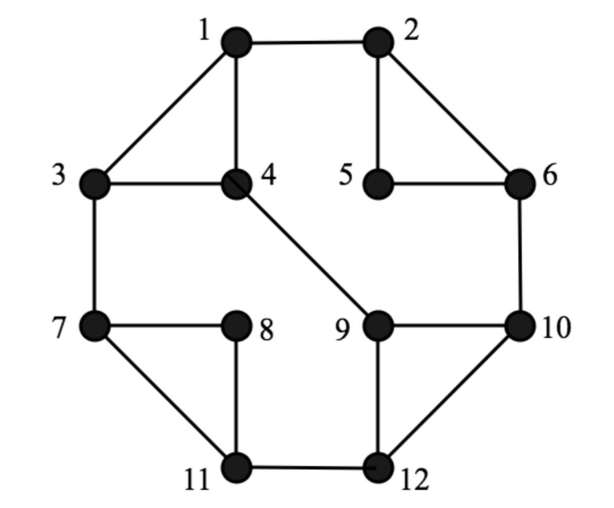
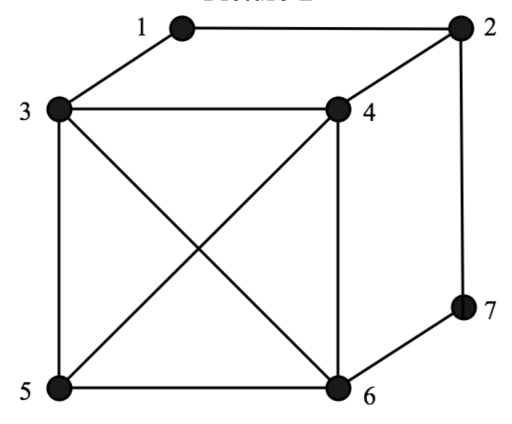
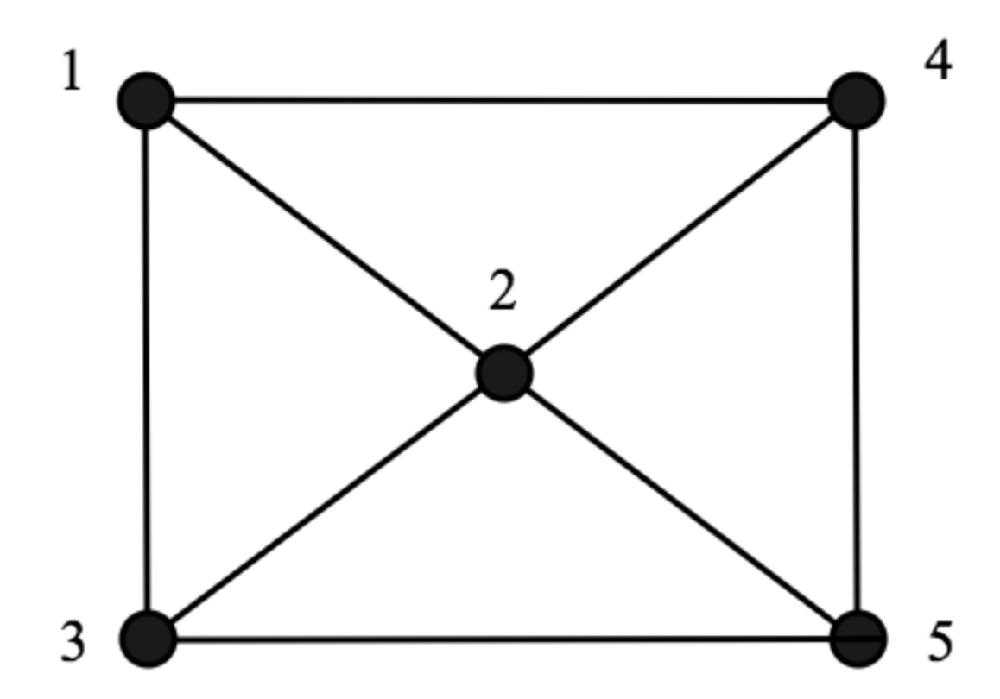

# one-stroke-drawing
A C++ program based on the Graph data structure to determine whether a given shape with given vertices and edges can be drawn in one stroke or not. This program implements the Graph structure using an Adjacency Matrix. More information on this can be found [here](https://www.geeksforgeeks.org/graph-and-its-representations/).

### Building and Running the Program
To build the project, download the repository locally and simply run the command `make all` to build. This creates the command line executable called findOneStroke. The program uses command line arguments to get the path of the file for the graph. Each argument supplied to the executable is processed for output. For example:

`./findOneStroke graph1.data` runs the program on just graph1.data.
`./findOneStroke graph1.data graph2.data` runs the program on graph1.data and graph2.data.
`./findOneStroke -all` is a special argument where the program is run on graph1.data through graph6.data.

The Graph.hpp and Graph.cpp files hold the logic to the Graph class which is behind everything. The main.cpp holds the testing case for parsing command line arguments and calling into the Graph class.

### Format of Input
The format of the input file is as follows: the first line contains the number of vertices and the number of edges, respectiely. The next lines contain the endpoints of edges. For example:

`5 6` 
`1 2` 
`1 2` 
`3 1` 
`2 4` 
`4 5` 
`5 2` 

represents the following picture:

In this drawing, a path is possible and it would be listed in the output.

### Examples
There are 6 graphs provided in the examples graph1.data - graph6.data :

Graph 1

Graph 2

Graph 3

Graph 4

Graph 5

Graph 6
